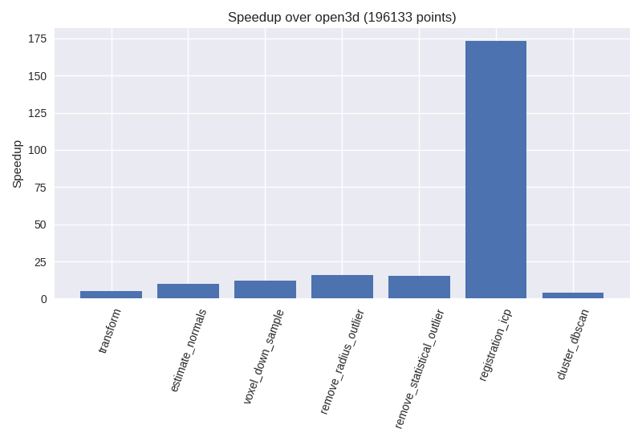

<p align="center">

</p>

# CUDA-based 3D Data Processing Library

[](https://travis-ci.com/neka-nat/cupoch)

Cupoch is a library that implements rapid 3D data processing using CUDA.

## Core Features

* 3D data processing using CUDA
* [Open3D](https://github.com/intel-isl/Open3D)-like API
* Interactive GUI (OpenGL CUDA interop and [imgui](https://github.com/ocornut/imgui))
* Interoperability between cupoch 3D data and [DLPack](https://github.com/dmlc/dlpack)(Pytorch, Cupy,...) data structure

## Installation

This software is tested under 64 Bit Ubuntu Linux 18.04 and CUDA 10.0.
You can install cupoch using pip.

```
pip install https://github.com/neka-nat/cupoch/releases/download/v0.0.1/cupoch-0.0.1.0-cp36-cp36m-linux_x86_64.whl
```

Or install cupoch from source.

```
git clone https://github.com/neka-nat/cupoch.git --recurse
cd cupoch
mkdir build
cd build
cmake ..; make install-pip-package -j
```

## Result
The figure shows Cupoch speedup over Open3d.
The environment tested on has the following specs:
* Intel Core i7-7700HQ CPU
* Nvidia GTX1070 GPU
* OMP_NUM_THREAD=1

